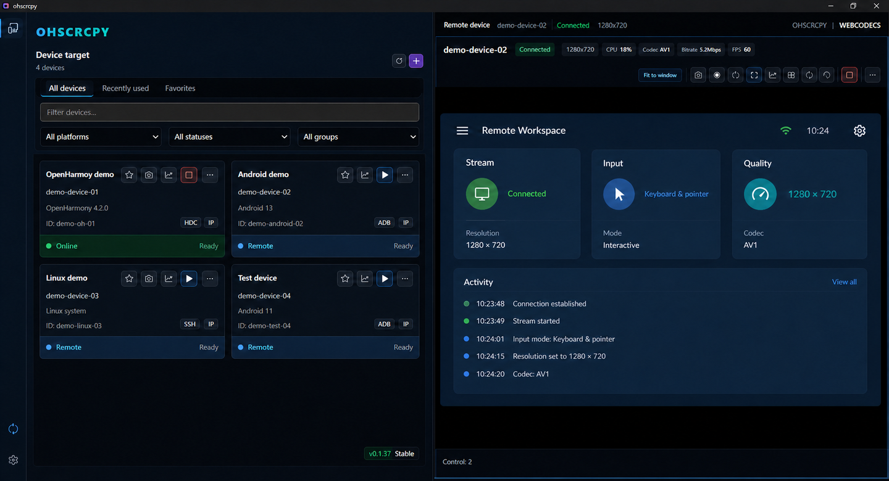
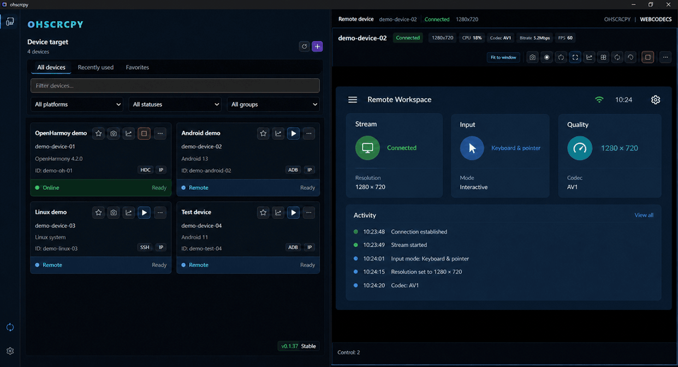

# ohscrcpy

[](https://github.com/snowlyg/ohscrcpy-releases/releases/latest)

[](LICENSE)

**Remote display, control, and device management for OpenHarmony and Android in one Windows workspace.**

[GitCode download](https://gitcode.com/snowlyg/ohscrcpy-releases/releases/latest) ·
[GitHub download](https://github.com/snowlyg/ohscrcpy-releases/releases/latest) ·
[简体中文](README.md) ·
[Release history](https://github.com/snowlyg/ohscrcpy-releases/releases) ·
[Issues](https://github.com/snowlyg/ohscrcpy-releases/issues)



## Highlights

- **One workspace for HDC and ADB** with automatic platform routing and an explicit platform override.
- **Concurrent remote sessions** with quality controls, local rotation, fit-to-window display, mouse input, and physical keyboard input.
- **Practical device tools** including application installation, SSH, SFTP, runtime logs, WebDebug status, and redacted diagnostic exports.
- **User-owned device catalog** with names, groups, favorites, ordering, and online state kept as independent data.
- **Verified updates** using ZIP packages and SHA-256 manifests mirrored on GitCode and GitHub.

## Live preview



## Quick start

1. Download `ohscrcpy-windows-x64-<version>.zip` and `SHA256SUMS-v<version>.txt` from [GitCode Releases](https://gitcode.com/snowlyg/ohscrcpy-releases/releases/latest) or [GitHub Releases](https://github.com/snowlyg/ohscrcpy-releases/releases/latest).
2. Verify the checksum, extract the ZIP, and run `ohscrcpy-start.exe`.
3. Prepare ADB for Android or HDC for OpenHarmony, enable debugging on the device, and start a remote session from the device list.

```powershell
Get-FileHash .\ohscrcpy-windows-x64-<version>.zip -Algorithm SHA256
```

The result must exactly match the corresponding entry in `SHA256SUMS-v<version>.txt`.

## Requirements

- Windows 10/11 x64 is the primary supported environment. A compatibility runtime is provided for Windows 8.1 and Windows Server 2012 R2.
- A working ADB installation for Android devices or HDC installation for OpenHarmony devices.
- OpenHarmony API 12 or newer; armv7 and aarch64 device servers are included.
- A device-side SSH service and valid credentials for SSH, SFTP, or remote reboot features.

## Documentation

- [Command-line options and examples](docs/cli.md)
- [Device detection, platform routing, and WebDebug](docs/routing-and-debugging.md)
- [Troubleshooting and diagnostics](docs/troubleshooting.md)
- Run `ohscrcpy --help` for the exact options supported by your installed version.

## Updates and support

GitCode and GitHub carry the same Windows ZIP and checksum manifest. The built-in updater downloads a ZIP, verifies SHA-256, creates a backup, replaces the application, and restarts it. Current releases do not require Chocolatey, nupkg, or another package manager.

Check the [latest release notes](https://github.com/snowlyg/ohscrcpy-releases/releases/latest) and [troubleshooting guide](docs/troubleshooting.md) first. When opening an [issue](https://github.com/snowlyg/ohscrcpy-releases/issues), include the version, platform, reproduction steps, and the UI-exported redacted diagnostic ZIP.

> ⚠️ **Privacy reminder: Never submit credentials, device addresses, unredacted screenshots, or raw diagnostic data to Issues.**

## License

Distributed under the [Apache License 2.0](LICENSE). The package includes licensing, copyright, and third-party attribution files.
