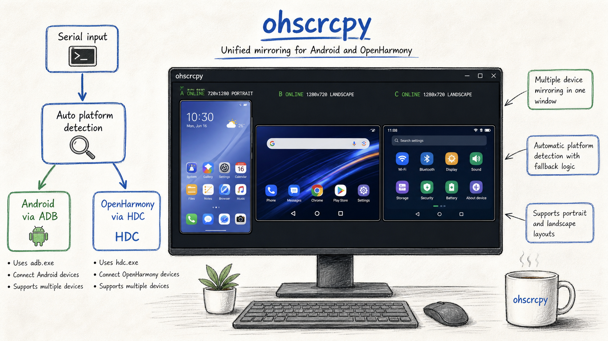

# ohscrcpy

[](../../releases/latest)

[](LICENSE)

`ohscrcpy` 是面向 Windows 的 OpenHarmony 与 Android 设备投屏和远程控制工具，
适用于真机调试、多设备状态对照和局域网设备操作。

[下载最新版](../../releases/latest) ·
[产品介绍](https://www.lodan.me/zh-cn/products/ohscrcpy/) ·
[查看更新记录](../../releases)

## 核心能力

- **双平台统一管理**：在同一个 Windows 工具中连接 Android（ADB）和
  OpenHarmony（HDC）设备。
- **多设备投屏**：同时观察和控制多台设备，便于比较界面与运行状态。
- **自动设备路由**：根据设备在线状态自动选择 ADB 或 HDC，也可手动指定平台。
- **设备操作工具**：支持安装 HAP/APK、打开 SSH 命令行、使用 SFTP 传输文件和
  重启设备。
- **本地网络工作流**：可通过局域网连接设备，减少频繁插拔数据线。
- **内置更新**：支持在应用内下载 ZIP、校验 SHA-256，并完成备份、替换和重启。

## 快速开始

### 1. 下载并启动

从 [Releases](../../releases/latest) 下载：

- `ohscrcpy-windows-x64-<version>.zip`：Windows x64 程序包。
- `SHA256SUMS-v<version>.txt`：程序包的 SHA-256 校验值。

解压 ZIP 后，运行 `ohscrcpy-start.exe`；也可以直接运行 `ohscrcpy.exe`。

如需校验下载文件，可在 PowerShell 中执行：

```powershell
Get-FileHash .\ohscrcpy-windows-x64-<version>.zip -Algorithm SHA256
```

将输出结果与 `SHA256SUMS-v<version>.txt` 中的值进行比较。

### 2. 准备设备工具

- Android 设备：安装 Android SDK Platform Tools，并确保 `adb.exe` 位于 `PATH`。
- OpenHarmony 设备：准备可用的 `hdc.exe`，并确保其位于 `PATH`。

同时确认目标设备已开启相应的调试能力，且可被 ADB 或 HDC 正常识别。

### 3. 连接设备

启动 ohscrcpy 后，在设备列表中选择在线设备并开始投屏。程序会先显示已保存的
设备信息，再由 ADB/HDC 在后台刷新实时状态。

使用 SSH 命令行、SFTP 文件传输或设备重启前，需要先在设备侧启用 SSH，并在
“设置 > SSH”中配置可用的账号、端口和密码。

## 典型场景

- 在一套工作流中调试 OpenHarmony 和 Android 真机。
- 同时投屏多台设备，对比不同系统、分辨率或版本下的 UI 状态。
- 通过局域网连接测试设备，减少 USB 数据线切换。
- 从设备操作菜单安装应用、进入远程命令行或传输测试文件。

## 设备检测与路由

默认情况下，ohscrcpy 会根据设备状态自动判断使用 Android 还是 OpenHarmony：

1. 设备只在 ADB 中在线时，使用 Android。
2. 设备只在 HDC 中在线时，使用 OpenHarmony。
3. 相同 Serial 在 ADB 与 HDC 中都可用时，优先使用 Android。
4. ADB 状态为 `offline` 或 `unauthorized`、但 HDC 在线时，使用 OpenHarmony。

也可以在启动参数中使用 `-Platform Android` 或 `-Platform OHOS` 强制指定平台。

> 下图为设备路由和多设备投屏的概念示意，不代表特定版本的实际界面。



## 命令行用法

需要脚本化启动时，可以直接指定单台或多台设备：

```powershell
ohscrcpy -s <ohos-device-serial>
ohscrcpy -s <android-device-serial>:5555
ohscrcpy -m "<android-device-a>:5555,<android-device-b>:5555"
ohscrcpy -m "<ohos-device-a>,<ohos-device-b>" -q Clear
```

常用参数：

| 简写 | 完整参数 | 说明 |
| --- | --- | --- |
| `-s` | `-Serial` | 单个设备 Serial |
| `-m` | `-Serials` | 最多 9 个逗号分隔的设备 |
| `-p` | `-Platform` | `Auto`、`OHOS` 或 `Android` |
| `-q` | `-Quality` | `Balanced` 或 `Clear` |
| `-c` | `-Codec` | `h264` 或 `h265` |
| `-f` | `-Fps` | 视频帧率 |
| `-b` | `-Bitrate` | 视频码率，单位 bps |
| `-v` | `--version` | 显示版本和开发者信息 |
| `-h` | `--help` | 显示完整帮助和示例 |

Android 使用 `-Quality Clear` 时，默认最大长边为 1920、帧率为 20 fps、码率为
8 Mbps。低分辨率设备保持原生尺寸，并通过更高码率减少压缩损失。

## 更新

从 v0.1.5 开始，应用检测到新版本后会在左下角显示“立即更新”。内置更新器会
下载 ZIP、校验 SHA-256，并在备份当前版本后完成替换和重启。也可以始终从
[Releases](../../releases) 手动下载并解压新版本。

## 环境要求

- Windows 10/11 x64。
- Android SDK Platform Tools（使用 Android 设备时）。
- OpenHarmony HDC 工具（使用 OpenHarmony 设备时）。
- SSH 服务与有效连接信息（使用 SSH、SFTP 或远程重启时）。

## 获取帮助

- 查看 [最新版本说明](../../releases/latest) 了解功能变化和已知要求。
- 使用 `ohscrcpy --help` 查看当前版本支持的完整命令行参数。
- 通过 [Issues](../../issues) 反馈可复现的问题或功能建议。

## License

本项目发行内容使用 [Apache License 2.0](LICENSE)。安装包内包含许可证、版权信息
和第三方组件归属文件。

Copyright 2026 求同存异。开发者：求同存异。<br>
联系邮箱：`brendenaudrina6287@gmail.com`。
